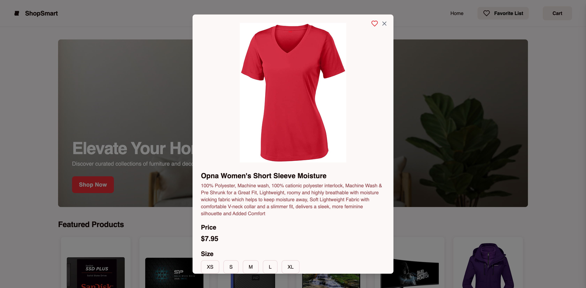
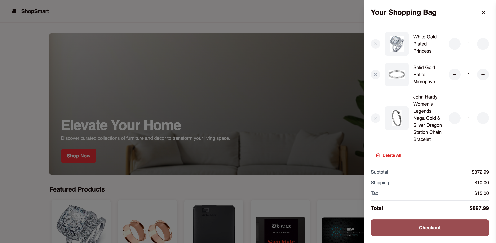
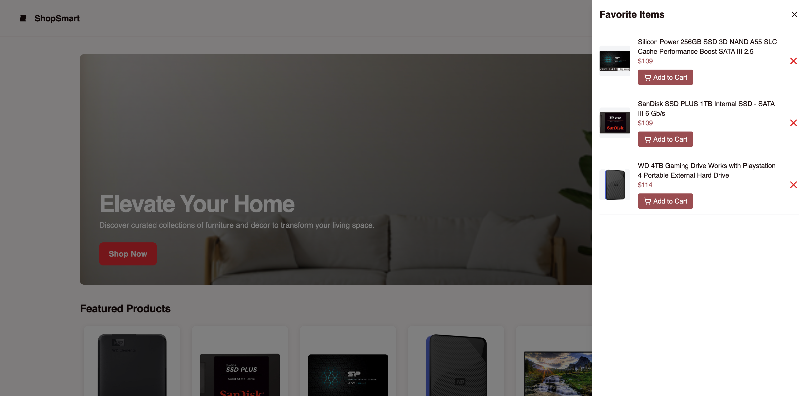
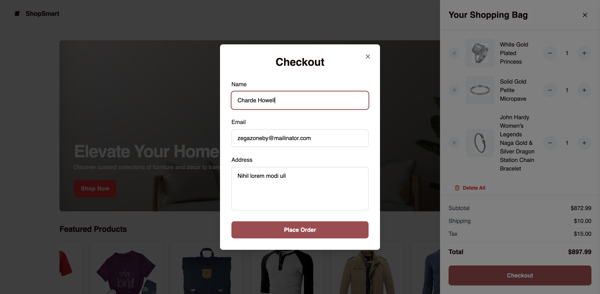

# Mini E-Commerce SPA 🛒

A modern, responsive single-page application (SPA) built with React.js and Tailwind CSS that provides a complete e-commerce experience including product browsing, detailed product views, shopping cart functionality, and checkout process.

## 🎯 Project Overview

This project is a fully functional e-commerce web application that allows users to:

- Browse a collection of products
- View detailed product information
- Add items to shopping cart
- Manage cart items with quantity controls
- Complete checkout process with order simulation

## 🚀 Live Demo

[**View Live Application**](https://qtech-assignment-zeta.vercel.app/)

## 📸 Project Screenshots

### Home Page


### Product Detail Page



### Shopping Cart Sidebar



### Favorite Items Sidebar



### Checkout Modal



## 🛠 Tech Stack

- **Frontend Framework:** React.js
- **Styling:** Tailwind CSS
- **Build Tool:** Vite
- **Version Control:** Git
- **Hosting:** [Your hosting platform - Vercel]

## ✨ Features

### 🏠 Home Page

- Responsive grid layout displaying 6+ products
- Product cards with image, title, price, and "Add to Cart" button
- Click-to-navigate product detail functionality
- Modern, clean design with hover effects

### 📱 Product Detail Page

- Comprehensive product information display
- High-quality product images
- Detailed product descriptions
- Price information
- "Add to Cart" functionality
- Responsive design for all devices

### 🛒 Shopping Cart Sidebar

- Slide-in/out sidebar animation
- Real-time cart updates
- Quantity controls (increase/decrease)
- Individual item removal
- Dynamic total calculation
- Persistent cart state

### 💳 Checkout Modal

- Modal popup interface
- Form validation
- Customer information fields:
  - Full Name
  - Email Address
  - Shipping Address
- Order simulation functionality
- Success/error feedback

## 🚀 Installation & Setup

### Prerequisites

- Node.js (v14 or higher)
- npm or yarn package manager
- Git

### Clone the Repository

```bash
git clone https://github.com/Moinulilm10/Qtech-Assignment.git
cd Qtech-Assignment
```

### Install Dependencies

```bash
npm install
```

### Run Development Server

```bash
npm run dev
```

The application will be available at `http://localhost:5173`

### Build for Production

```bash
npm run build
```

### Preview Production Build

```bash
npm run preview
```

## 📁 Project Structure

```
qtech-assignment/
├── public/
│   ├── images/
│   └── index.html
├── src/
│   ├── components/
│   │   ├── Cart/
│   │   ├── Checkout/
│   │   ├── Product/
│   │   └── Layout/
│   ├── pages/
│   │   ├── Home.jsx
│   │   └── ProductDetail.jsx
│   ├── context/
│   │   └── CartContext.jsx
│   ├── data/
│   │   └── products.js
│   ├── utils/
│   ├── App.jsx
│   └── main.jsx
├── package.json
├── tailwind.config.js
├── vite.config.js
└── README.md
```

## 🎨 Design Principles

- **Responsive Design:** Mobile-first approach ensuring compatibility across all devices
- **Modern UI/UX:** Clean, intuitive interface with smooth animations
- **Performance Optimized:** Fast loading times and efficient state management
- **Accessibility:** Semantic HTML and keyboard navigation support
- **Industry Standards:** Following React best practices and coding conventions

## 🔧 Key Components

### CartContext

- Global state management for cart functionality
- Persistent cart data across page navigation
- Cart operations (add, remove, update quantities)

### ProductCard

- Reusable component for product display
- Hover effects and interactive elements
- Responsive image handling

### CartSidebar

- Animated slide-in/out functionality
- Real-time cart updates
- Quantity management controls

### CheckoutModal

- Form validation and submission
- Modal state management
- Order processing simulation

## 📱 Responsive Design

The application is fully responsive and optimized for:

- **Desktop:** 1200px and above
- **Tablet:** 768px - 1199px
- **Mobile:** 320px - 767px

## 🔍 Browser Support

- Chrome (latest)
- Firefox (latest)
- Safari (latest)
- Edge (latest)

## 🚀 Deployment

This project is deployed on [Your Hosting Platform] and automatically updates with each push to the main branch.

### Manual Deployment Steps:

1. Build the project: `npm run build`
2. Upload the `dist` folder to your hosting platform
3. Configure routing for SPA (if required)

## 📧 Contact Information

**Email:** moinulilm10@gmail.com  
**Phone:** +8801775100961  
**GitHub:** [Moinulilm10](https://github.com/Moinulilm10)

## 📄 License

This project is licensed under the MIT License - see the [LICENSE](LICENSE) file for details.

## 🙏 Acknowledgments

- React.js community for excellent documentation
- Tailwind CSS for the utility-first CSS framework
- Unsplash for placeholder images
- Icons from Lucide React

---
